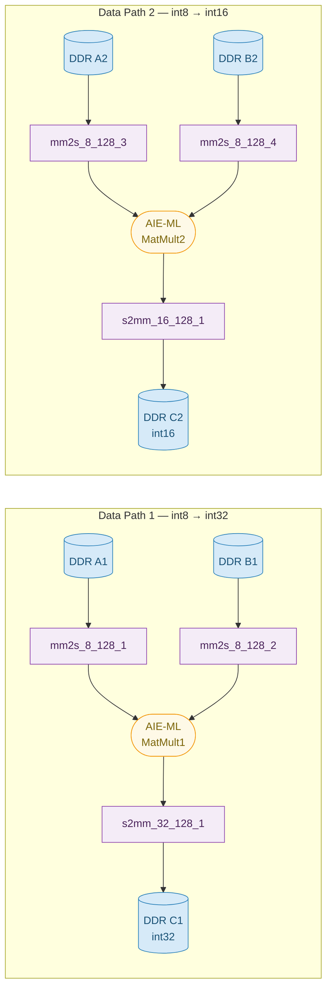

# aie-ml_sys_design

## Overview

This example demonstrates an AIE-ML 8-bit integer matrix multiplication design on the **VEK280** (or **VEK385**) board. Two parallel data paths run over separate AIE-ML tile partitions: one produces 32-bit (`int32`) output and the other produces 16-bit (`int16`) output, both from the same `int8` input matrices A and B. PL `mm2s` DMA kernels stream the input matrices from DDR into the AIE-ML array via 128-bit PLIOs, and PL `s2mm` DMA kernels write the computed results back to DDR. The host application loads input data from files, runs both data paths, and compares the hardware output against a software-computed reference, printing `TEST PASSED` on success.

## Data flow



## Source files

| File | Description |
|------|-------------|
| `src/host.cpp` | PS host application — loads input matrices, runs PL kernels and AIE-ML graph, validates 32-bit and 16-bit outputs |
| `src/graph.cpp` | Instantiates `TestMatMult GMatMult`; contains AIE simulator `main` |
| `src/MultGraph.h` | ADF graph classes: `MatrixMultiply<ITYPE,OTYPE,SHIFT_RESULT,ARRAY_COL>` (single path) and `TestMatMult` (dual-path top-level) |
| `src/matmult.cpp` | AIE-ML kernel: `ClassicMatMult` — tiled matrix multiply using AIE-ML MAC intrinsics |
| `src/kernels.h` | AIE-ML kernel function template declaration |
| `src/system_settings.h` | Matrix dimension macros (`A_ROWS/COLS`, `B_ROWS/COLS`, `C_ROWS/COLS`, tile dimensions) derived from compile-time defines |
| `src/tiling_parameters.h` | ADF tiling access patterns (`WriteAns`, `ReadAns`, `WriteBns`, `ReadBns`, `WriteCns`, `ReadCns`) |
| `src/mm2s_8_128.cpp` | HLS PL kernel: streams `int8` data from AXI-MM (DDR) to 128-bit AXI-Stream (4 instances) |
| `src/s2mm_32_128.cpp` | HLS PL kernel: captures 128-bit AXI-Stream and writes `int32` results to AXI-MM (DDR) |
| `src/s2mm_16_128.cpp` | HLS PL kernel: captures 128-bit AXI-Stream and writes `int16` results to AXI-MM (DDR) |
| `system.cfg` | `v++` connectivity config: instantiates 4× `mm2s_8_128`, 1× `s2mm_32_128`, 1× `s2mm_16_128` and wires them to AIE-ML PLIOs |
| `data/inputA_128.txt` | 8-bit integer matrix A test input |
| `data/inputB_128.txt` | 8-bit integer matrix B test input |
| `data/outputC_ref_128_32b.txt` | Golden 32-bit output reference for verification |
| `data/outputC_ref_128_16b.txt` | Golden 16-bit output reference for verification |

## Environment setup

The following environment variables must be set before building:

```bash
# Vitis installation root (required)
export XILINX_VITIS=/path/to/Vitis/2026.1

# Path that contains sw/versal/xilinx-versal-common-v2026.1/
export PLATFORM_REPO_PATHS=/path/to/platform/repo

# Optional: override the default platform (default targets VEK280; use vek385 variant for VEK385)
export PLATFORM=xilinx_vek280_base_202610_1

# Optional: override the common image path (derived from PLATFORM_REPO_PATHS by default)
export COMMON_IMAGE_VERSAL=${PLATFORM_REPO_PATHS}/sw/versal/xilinx-versal-common-v2026.1
```

Source the Vitis environment script to add `v++`, `aiecompiler`, and cross-compile toolchain to `PATH`:

```bash
source ${XILINX_VITIS}/settings64.sh
```

## Matrix dimension defines

The following compile-time defines control the matrix dimensions and iteration count. They are passed to both the AIE-ML compiler and the host cross-compiler. The defaults match the test data files provided in `data/`.

| Define | Default | Description |
|--------|---------|-------------|
| `sizeM` | `128` | Number of rows in matrix A (and C) |
| `sizeK` | `128` | Number of columns in A / rows in B |
| `sizeN` | `128` | Number of columns in matrix B (and C) |
| `subM` | `4` | AIE-ML tile height for A/C |
| `subK` | `16` | AIE-ML tile width for A / height for B |
| `subN` | `8` | AIE-ML tile width for B/C |
| `NIterations` | `1` | Number of graph run iterations |
| `PLIOW` | `128` | PLIO width in bits |

## Build and run

### Full build and emulation

```bash
# Build everything and launch hw_emu (default TARGET=hw_emu)
make all

# Or step-by-step (order matters — host depends on graph):
make kernels    # HLS sources → .xo files
make graph      # AIE-ML graph → libadf.a + generates aie_control_xrt.cpp
make xsa        # link → aie-ml_sys_design.xsa
make package    # package → launch_hw_emu.sh
make host       # cross-compile host.cpp + aie_control_xrt.cpp → aie-ml_sys_design.exe

make run        # launch hw_emu and run host application
```

### Override platform, target, or matrix dimensions

```bash
# Build for hardware
make build TARGET=hw

# Use VEK385 platform
make build PLATFORM=xilinx_vek385_base_202610_1

# Custom matrix dimensions
make build sizeM=64 sizeK=64 sizeN=64

# Multiple iterations
make build NIterations=4
```

### Clean

```bash
make cleanall   # removes build/, .Xil, *.log, *.jou, vitis_* directories
```

## Expected output

A successful hardware emulation run produces output similar to:

```
The design will run 1 Iterations

Data sizes
INPUT_SIZEA: 16384 --> 16384
INPUT_SIZEB: 16384 --> 16384
OUTPUT_SIZEC1: 16384 --> 65536
OUTPUT_SIZEC2: 16384 --> 32768
...
Graph run: 1
Iteration 0 starts...
Should be running. Entering wait state...
Iteration ended correctly.

mm2s (A1) completed with status(4)    # 4 = ERT_CMD_STATE_COMPLETED
mm2s (B1) completed with status(4)
mm2s (A2) completed with status(4)
mm2s (B2) completed with status(4)
s2mm (C1) completed with status(4)
s2mm (C2) completed with status(4)
Compare Ref and aie in 32b
Compare Ref and aie in 16b
TEST PASSED
```

## Build artifacts

All build artifacts are placed under `build/$(TARGET)/`:

| Artifact | Description |
|----------|-------------|
| `build/hw_emu/*.xo` | Compiled HLS kernel objects |
| `build/hw_emu/libadf.a` | Compiled AIE-ML graph library |
| `build/hw_emu/aie-ml_sys_design.xsa` | Linked hardware platform |
| `build/hw_emu/aie-ml_sys_design.xclbin` | Final packaged binary |
| `build/hw_emu/aie-ml_sys_design.exe` | Cross-compiled host application |
| `build/hw_emu/launch_hw_emu.sh` | Hardware emulation launch script |

---

## Host Application — XRT hw_context API

`src/host.cpp` uses the modern XRT C++ `xrt::hw_context` API.

| Topic | Detail |
|---|---|
| **xclbin loading** | Uses `xrt::xclbin` + `device.register_xclbin()` to load the xclbin; `device.load_xclbin()` is deprecated. |
| **Kernels and graph** | `xrt::kernel(hw_ctx, name)` and `xrt::graph(hw_ctx, "GMatMult")` both take `hw_ctx`; the `(device, uuid, name)` forms are deprecated. Kernels are started via `xrt::kernel::operator()(bo, args...)`, which creates and starts an `xrt::run` in one call; the returned handle is used for `.wait()`. |
| **BO allocation after kernel construction** | BOs must be allocated after `xrt::kernel` objects are created so that `kernel.group_id(0)` can be used to select the correct DDR memory group. Input BOs use `mm2sXX_khdl.group_id(0)`; output BOs use `s2mmCX_khdl.group_id(0)`. On some platforms group `0` is `Bank Used: No`, which causes a runtime exception at kernel invocation. Always use `xrt::bo(hw_ctx, size, krnl.group_id(0))`. |
| **RAII** | No explicit resource-release calls needed; C++ destructors handle teardown of kernels, BOs, and graph. |
