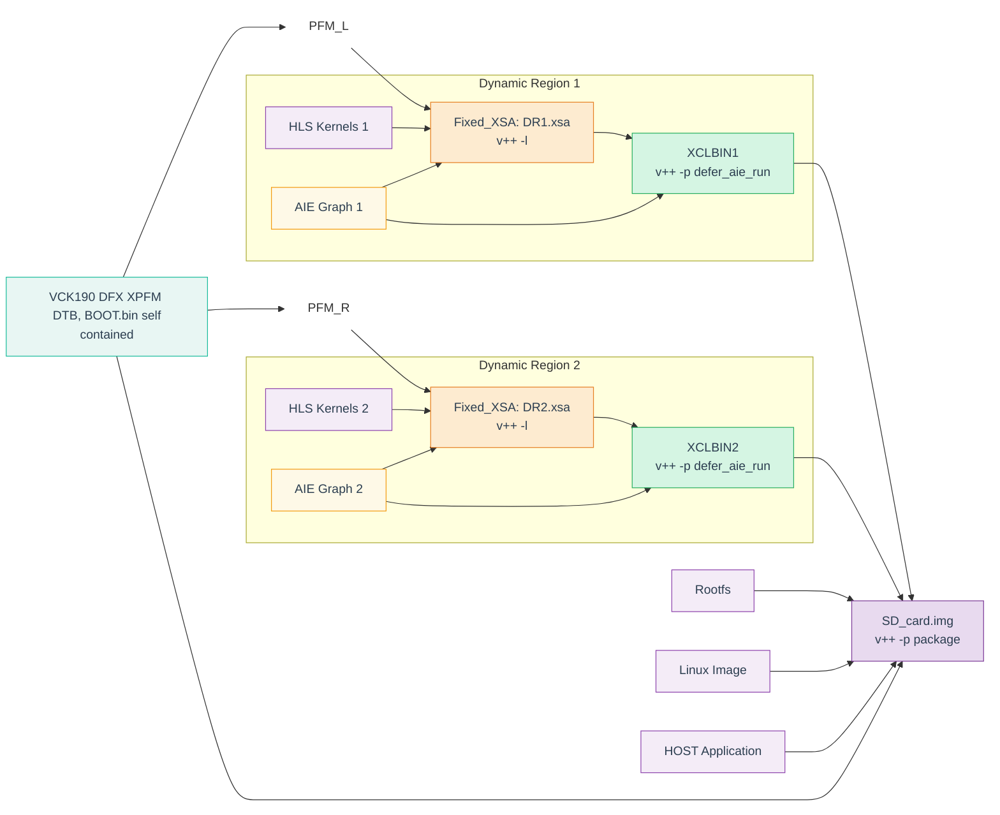

###  DFX Design development Flow
**Vitis 2025.1**

>Note: In this diagram, PFM_L and PFM_R represent the same vck190 base DFX platform as XPFM — they are just shown separately to make the diagram lines clearer.
